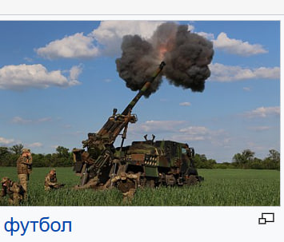

that's football:


inspired by: https://www.youtube.com/watch?v=gLtO9p_C7vk

deal with it
```javascript
node translate.js '.\Операция барбаросса.html' ru 30
```
copy content via dev tools and save it into an html file then run da script and paste new file contents back
probably will work if you just save it using save as but this is gonna include a lot of junk and slow down the translation
